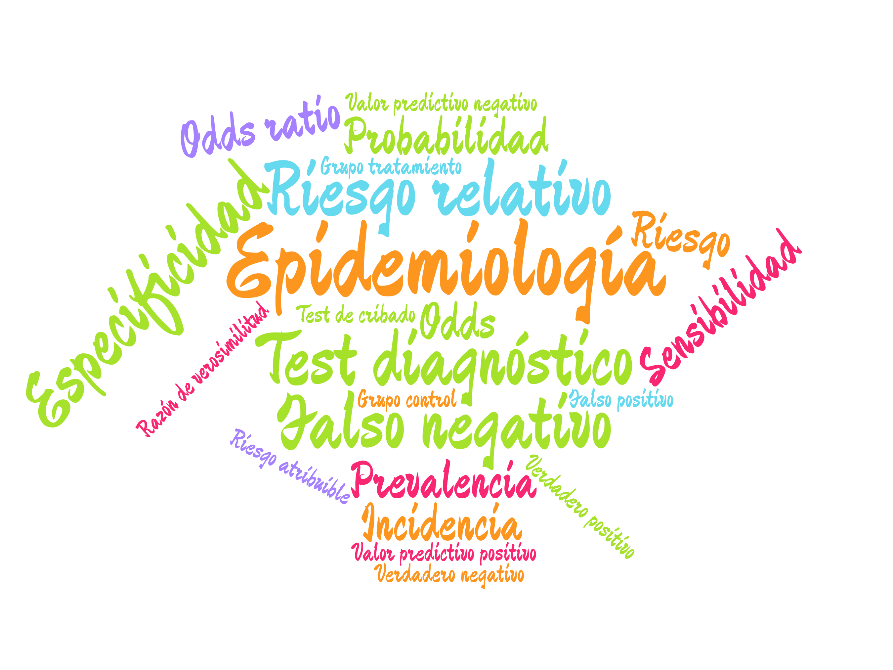

# Introducción a la Epidemiología {#sec-introduccion}

## ¿Qué es la Epidemiología?

La palabra *epidemiología* viene del griego *epi* (sobre), *demos* (gente) y *logos* (estudio), es decir, el estudio de lo que le ocurre a las poblaciones.

:::{#def-epidemiologia}
## Epidemiología
En el ámbito de la salud pública, la _Epidemiología_ es la rama de la Medicina que se encarga del estudio de la distribución y las causas de los eventos relacionados con la salud (normalmente enfermedades) en las poblaciones, y de la aplicación de este estudio al control de los problemas de salud pública.
:::

{#fig-detective width=80%}

Obsérvese que, a diferencia de la Medicina clínica, que se ocupa del diagnóstico y el tratamiento de un paciente concreto, la Epidemiología estudia siempre *poblaciones*. Sus dos preguntas fundamentales son:

- ¿Cuánta enfermedad hay y cómo se distribuye? (*Epidemiología descriptiva*)
- ¿Qué factores la causan o la previenen? (*Epidemiología analítica*)

Debido a la epidemia provocada por el coronavirus, la Epidemiología se ha convertido en una de las ramas de la Medicina que más interés despiertan.

{#fig-fernando-simon width=60%}

Sin embargo, mucho antes de la COVID, la Epidemiología ya había servido en otros momentos históricos para resolver o controlar algunos de los problemas de salud pública más serios que ha enfrentado la humanidad.

### Algunos descubrimientos históricos

- **1854**: John Snow determina que la causa de la epidemia de cólera que asolaba Londres era que el agua estaba contaminada con heces.
- **1898**: Ronald Ross averigua que el transmisor de la malaria es el mosquito *Anopheles*.
- **1950**: Se descubre que fumar es el principal factor de riesgo del cáncer de pulmón.
- **1954**: Se valida la primera vacuna contra la poliomielitis (la de Jonas Salk).
- **1970**: Se observa que el ejercicio físico y una dieta sana reducen el riesgo de sufrir un infarto.
- **1983**: Robert Gallo, Luc Montagnier y Françoise Barré-Sinoussi identifican el virus que causa el SIDA. Poco después se observó que el riesgo de contraer el VIH aumentaba con ciertas prácticas sexuales y con el consumo de algunos tipos de drogas.
- **2020**: Y llegó la COVID...

## El lenguaje de la Epidemiología

En estos tiempos de pandemia un montón de términos técnicos de la Epidemiología se han convertido en lugares comunes gracias a los medios de comunicación.

{#fig-wordcloud}

Sin embargo, muchos de estos términos se utilizan de manera errónea, incluso por los propios medios de comunicación, y generan confusión en la población no experta. En este manual se explican los principales conceptos epidemiológicos usados en el control de enfermedades como la COVID y se ilustra su uso con ejemplos de aplicación.

## Índices epidemiológicos

Los índices epidemiológicos que se estudian en este manual pueden agruparse en tres bloques:

**Medidas de frecuencia de una enfermedad** (@sec-medidas-frecuencia)

: Miden cuánta enfermedad hay en una población.

    - Prevalencia.
    - Incidencia o riesgo absoluto.

**Medidas de asociación** (@sec-medidas-asociacion)

: Miden la relación entre la exposición a un factor y la aparición de la enfermedad.

    - Riesgo y odds.
    - Riesgo relativo y odds ratio.

**Medidas de fiabilidad de los tests diagnósticos** (@sec-tests-diagnosticos y @sec-curva-roc)

: Miden la capacidad de un test para diagnosticar o descartar la enfermedad.

    - Sensibilidad y especificidad.
    - Valores predictivos.
    - Curva ROC y área bajo la curva.

Todos estos índices están basados en el cálculo de probabilidades, por lo que en el siguiente capítulo se introduce el concepto de probabilidad y sus principales propiedades.
